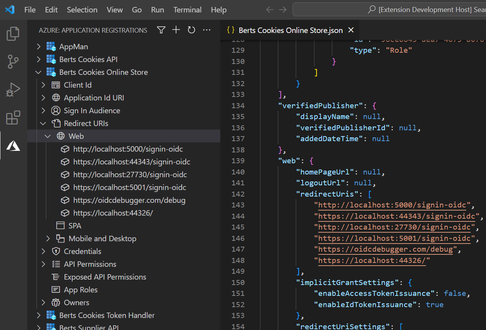

# Azure Application Registration Management for VS Code

This Visual Studio Code extension provides an easy way to view and manage Azure Application Registrations outside of the Azure Portal.

It allows for easy viewing, copying, adding, and editing of most the core application properties, such as:

* Application Id
* Sign In Audience
* Redirect URIs
* API Permissions
* Exposed API Permissions
* App Roles
* Owners

It also allows for the simple creation of new applications, quickly viewing of the full application manifest in the editor, and has the ability to open the application registration directly in the Azure Portal when you need full editing control. Once loaded, the application registration list can also be filtered by display name.

All application properties have their own range of functionality. From the application itself, down to each individual property, functionality can be accessed via a range of context menus. If required functionality is not currently implemented for a particular property then you can open the application registration in the Azure portal from the context menu of the application itself.

By default, to improve performance, the application list is limited to 100 applications. This however is exposed as a user setting and can be changed if you wish.

## Authentication
This extension uses the `AzureCliCredential` to authenticate the user and gain an access token required to manage applications. This means it does not use the Azure Account identity, but rather the Azure CLI. This is a workaround due to a [known issue](https://learn.microsoft.com/en-us/javascript/api/overview/azure/identity-readme?view=azure-node-latest#note-about-visualstudiocodecredential) with the `VisualStudioCodeCredential` and Azure Account extension >= v0.10.0.

Please ensure your Azure CLI is authenticated to the correct tenant using `az login --tenant <tenant_name or tenant_id>`. If you are not authenticated using the Azure CLI the extension will offer the opportunity to sign in to the tenant of your choice.

The access token used for this extension uses the scope `Directory.AccessAsUser.All`. This means that it will use the Azure RBAC directory roles assigned to the authenticated user, and hence requires a role that allows for application management.

## Notes
This extension was created both as a learning exercise, and to address the common annoyances of managing Application Registrations. It is not officially supported and you use it at your own risk.

It has a dependency on the [Azure Tools extension pack](https://marketplace.visualstudio.com/items?itemName=ms-vscode.vscode-node-azure-pack), but only because it places the application registrations view into the Azure view container.

## Known Issues
Due to the [eventual consistency](https://blogs.aaddevsup.xyz/2021/08/why-do-i-sometimes-get-a-404-when-trying-to-update-an-azure-directory-object-after-i-just-created-it/) of Azure Active Directory, when adding or removing owners they do not always show correctly when the tree view renders after the change. If this happens just wait a short time before refreshing the list again.